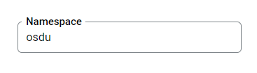

## Service Configuration for Google Cloud

## Environment variables

Define the following environment variables.

Must have:

| name                     | value                                | description                                                                     | sensitive? | source |
|--------------------------|--------------------------------------|---------------------------------------------------------------------------------|------------|--------|
| `SHARED_TENANT_NAME`     | ex `osdu`                            | Shared account id                                                               | no         | -      |
| `GCP_AIRFLOW_URL`        | ex `https://********-tp.appspot.com` | Airflow endpoint                                                                | yes        | -      |
| `SHARED_TENANT_NAME`     | ex `osdu`                            | Shared account id                                                               | no         | -      |

Defined in default application property file but possible to override:

| name                               | value                                         | description                                                                                                                                            | sensitive? | source                                                       |
|------------------------------------|-----------------------------------------------|--------------------------------------------------------------------------------------------------------------------------------------------------------|------------|--------------------------------------------------------------|
| `LOG_PREFIX`                       | `workflow`                                    | Logging prefix                                                                                                                                         | no         | -                                                            |
| `AUTHORIZE_API`                    | ex `https://entitlements.com/entitlements/v1` | Entitlements API endpoint                                                                                                                              | no         | output of infrastructure deployment                          |
| `PARTITION_API`                    | ex `http://localhost:8081/api/partition/v1`   | Partition service endpoint                                                                                                                             | no         | output of infrastructure deployment                          |
| `GOOGLE_APPLICATION_CREDENTIALS`   | ex `/path/to/directory/service-key.json`      | Service account credentials, you only need this if running locally                                                                                     | yes        | <https://console.cloud.google.com/iam-admin/serviceaccounts> |
| `STATUS_CHANGED_MESSAGING_ENABLED` | `true` OR `false`                             | Allows configuring message publishing about schemas changes to Pub/Sub                                                                                 | no         | -                                                            |
| `STATUS_CHANGED_TOPIC_NAME`        | ex `status-changed`                           | Allows to subscribe a specific Pub/Sub topic                                                                                                           | no         | -                                                            |
| `OSDU_AIRFLOW_VERSION2`            | `true` OR `false`                             | Allows to configure Airflow API used by Workflow service, choose `true` to use `stable` API, `false` to use `experimental` API, by default used `true` | no         | -                                                            |
| `COMPOSER_CLIENT`                  | `IAAP` OR `V2` OR `NONE`                      | Allows to configure authentication method used by Workflow to authenticate its requests to Airflow, by default `IAAP` is used                          | no         | -                                                            |
| `MANAGEMENT_ENDPOINTS_WEB_BASE`    | ex `/`                                        | Web base for Actuator                                                                                                                                  | no         | -                                                            |
| `MANAGEMENT_SERVER_PORT`           | ex `8081`                                     | Port for Actuator                                                                                                                                      | no         | -                                                            |
| `DESTINATION_RESOLVER`             | ex `partition`                                | Destination resolver is getting product properties from the Partition Service                                                                          | no         | -                                                            |
| `SECRET_API`                       | ex `http://secret/api/secret/v2`              | Secret service API endpoint                                                                                                                            | no         | output of infrastructure deployment                          |
| `GROUP_ID`                         | ex `group`                                    | The id of the groups is created. The default (and recommended for `jdbc`) value is `group`                                                             | no         | -                                                            |
| `OTEL_JAVAAGENT_ENABLED`           | ex `true` or `false`                          | `true` - OpenTelemetry Java agent enabled, `false` - disabled                                                                                          | no         |                                                              |
| `OTEL_EXPORTER_OTLP_ENDPOINT`      | ex `http://127.0.0.1:4318`                    | OpenTelemetry collector endpoint                                                                                                                       | no         |                                                              |

### Running E2E Tests

You will need to have the following environment variables defined.

| name                                | value                                                         | description                                                                                                                                       | sensitive? | source                                                       |
|-------------------------------------|---------------------------------------------------------------|---------------------------------------------------------------------------------------------------------------------------------------------------|------------|--------------------------------------------------------------|
| `DOMAIN`                            | ex `contoso.com`                                              | OSDU R2 to run tests under                                                                                                                        | no         | -                                                            |
| `INTEGRATION_TESTER`                | `********`                                                    | Service account for API calls, as a filename or JSON content, plain or Base64 encoded.  Note: this user must have entitlements configured already | yes        | <https://console.cloud.google.com/iam-admin/serviceaccounts> |
| `NO_DATA_ACCESS_TESTER`             | `********`                                                    | Service account without data access, as a filename or JSON content, plain or Base64 encoded.                                                      | yes        | <https://console.cloud.google.com/iam-admin/serviceaccounts> |
| `LEGAL_TAG`                         | `********`                                                    | Demo legal tag used to pass test                                                                                                                  | yes        | Legal service                                                |
| `WORKFLOW_HOST`                     | ex `https://os-workflow-dot-opendes.appspot.com/api/workflow` | Endpoint of workflow service                                                                                                                      | no         | -                                                            |
| `DEFAULT_DATA_PARTITION_ID_TENANT1` | ex `opendes`                                                  | OSDU tenant used for testing                                                                                                                      | no         | -                                                            |
| `OTHER_RELEVANT_DATA_COUNTRIES`     | `US`                                                          | -                                                                                                                                                 | no         | -                                                            |
| `FINISHED_WORKFLOW_ID`              | `********`                                                    | Workflow ID with finished status                                                                                                                  | yes        | -                                                            |
| `TEST_DAG_NAME`                     | `********`                                                    | Name of test DAG                                                                                                                                  | yes        | -                                                            |
| `OSDU_AIRFLOW_VERSION2`             | `true` or `false`                                             | Disable\Enable tests that work only with specific Airflow version                                                                                 | no         | -                                                            |
| `ENTITLEMENT_V2_URL`                | ex `http://localhost:8080/api/entitlements/v2/`               | Entitlements V2 Host                                                                                                                              | no         | --                                                           |

**Entitlements configuration for integration accounts**

| INTEGRATION_TESTER                                                                                                                                                                                                                                  | NO_DATA_ACCESS_TESTER |
|-----------------------------------------------------------------------------------------------------------------------------------------------------------------------------------------------------------------------------------------------------|-----------------------|
| service.workflow.system-admin<br/>users<br/>service.entitlements.user<br/>service.workflow.admin<br/>service.workflow.creator<br/>service.workflow.viewer<br/>service.legal.admin<br/>service.legal.editor<br/>data.test1<br/>data.integration.test | users                 |

```bash
# build + install integration test core
$ (cd testing/workflow-test-core/ && mvn clean install)

# build + run Google Cloud integration tests.
#
# Note: this assumes that the environment variables for integration tests as outlined
#       above are already exported in your environment.
$ (cd testing/workflow-test-gc/ && mvn clean test)
```

## Datastore configuration

There must be a namespace for each tenant, which is the same as the tenant name.

Example:



Kinds `workflow_osm` and `workflow_run_osm` will be created by the service if it does not exist.

## Pub/Sub configuration

At Pubsub should be created a topic with the name:

**name:** `status-changed`

It can be overridden by:

- through the Spring Boot property `gcp.status-changed.topicName`
- environment variable `STATUS_CHANGED_TOPIC_NAME`

## Google cloud service account configuration

TBD

| Required roles            |
|---------------------------|
| service.entitlements.user |
| service.secret.viewer     |
| workflow.secret.viewers   |

## Monitoring
### OpenTelemetry Integration

The opentelemetry-javaagent.jar file is the OpenTelemetry Java agent. It is used to
automatically instrument the Java application at runtime, without requiring manual changes
to the source code.

This provides critical observability features:
* Distributed Tracing: To trace the path of requests as they travel across different
  services.
* Metrics: To capture performance indicators and application-level metrics.
* Logs: To correlate logs with traces and other telemetry data.

Enabling this agent makes it significantly easier to monitor, debug, and manage the
application in development and production environments. The agent is activated by the
startup.sh script when the OTEL_JAVAAGENT_ENABLED environment variable is set to true.

The agent is available from the official OpenTelemetry GitHub repository. It is
recommended to use the latest stable version.

Official Download Page:
https://github.com/open-telemetry/opentelemetry-java-instrumentation/releases

## External Composer Airflow support

The Workflow service supports integration with external Airflow instances on GCP Composer. To run DAGs in external Airflow, the `externalAirflowSecret` property must be set in the `registrationInstructions` when creating a workflow.
If the `externalAirflowSecret` is set in the workflow, all the requests to Airflow will use the connection properties specified in the secret.

The secret specified in `externalAirflowSecret` should contain JSON with Airflow connection properties:

```json
{
 "airflowApiClientType": "gcpComposer",
 "url": "https://airflow.composer.host.example",
 "version": "v2"
}
```

- `version` is the Airflow API version (e.g., "v2").
- `airflowApiClientType` should be exactly `gcpComposer` for GCP Composer support, or `BasicAuth` if using basic authentication (username/password).
- `url` property is mandatory to specify the Airflow composer host.

> **Note:** The workflow service account should have the groups mentioned in the secret ACL (`secretAcls`) to be able to access that secret. Additionally, the Workflow Google Service account must have the appropriate IAM permissions to access the target Composer Airflow instance. 
> 
> **Important Airflow Configuration:** The Workflow service **will not** provide configurations for external Airflow instances. It is entirely the **user's responsibility** to configure the targeted external Airflow instance so it can operate with OSDU. This includes ensuring:
> - Proper access to the OSDU Entitlements service.
> - All required PyPi packages and environment variables are present.
> - All necessary DAGs are deployed.
> 
> For details and scripts on what a typical OSDU Airflow configuration looks like, please refer to the [Airflow Bootstrap Repository](https://community.opengroup.org/osdu/platform/deployment-and-operations/base-containers-gcp/airflow-bootstrap).

Example of creating a secret with Airflow connection properties using the Secret Service:

```shell
curl --request POST \
  --url https://{path}/api/secret/v2/secrets \
  --header 'Authorization: Bearer {token}' \
  --header 'Content-Type: application/json' \
  --header 'data-partition-id: osdu' \
  --data '{
	"id": "external_airflow_secret",
	"value": "{\"airflowApiClientType\": \"gcpComposer\",\"url\": \"https://airflow.composer.host.example\",\"version\": \"v2\"}",
	"secretAcls": {
		"viewers": [
			"workflow.secret.viewers@osdu.group"
		],
		"owners": [
			"workflow.secret.owners@osdu.group"
		]
	},
	"enabled": true
}'
```

When we create a workflow via a POST request, we should pass the `dagName` present in that external Airflow instance and the secret ID (`externalAirflowSecret`) we just created:

```shell
curl --request POST \
  --url https://{path}/api/workflow/v1/workflow \
  --header 'Authorization: Bearer {token}' \
  --header 'Content-Type: application/json' \
  --header 'data-partition-id: osdu' \
  --data '{
	"workflowName": "external_airflow_example",
	"description": "This is an example of creating a workflow that executes on external Airflow.",
	"registrationInstructions": {
		"dagName": "airflow_monitoring",
		"externalAirflowSecret": "external_airflow_secret"
	}
}'
```

Then we can trigger a workflow run via POST request using the earlier chosen workflow name as usual:

```shell
curl --request POST \
  --url https://{path}/api/workflow/v1/workflow/external_airflow_example/workflowRun \
  --header 'Authorization: Bearer {token}' \
  --header 'Content-Type: application/json' \
  --header 'data-partition-id: osdu' \
  --data '{}'
```

Then we can get the workflow run status via GET requests, as usual:

```shell
curl --request GET \
  --url https://{path}/api/workflow/v1/workflow/external_airflow_example/workflowRun/{runId} \
  --header 'Authorization: Bearer {token}' \
  --header 'Content-Type: application/json' \
  --header 'data-partition-id: osdu'
```

## License

Copyright © Google LLC
Copyright © EPAM Systems

Licensed under the Apache License, Version 2.0 (the "License");
you may not use this file except in compliance with the License.
You may obtain a copy of the License at

[http://www.apache.org/licenses/LICENSE-2.0](http://www.apache.org/licenses/LICENSE-2.0)

Unless required by applicable law or agreed to in writing, software
distributed under the License is distributed on an "AS IS" BASIS,
WITHOUT WARRANTIES OR CONDITIONS OF ANY KIND, either express or implied.
See the License for the specific language governing permissions and
limitations under the License.
